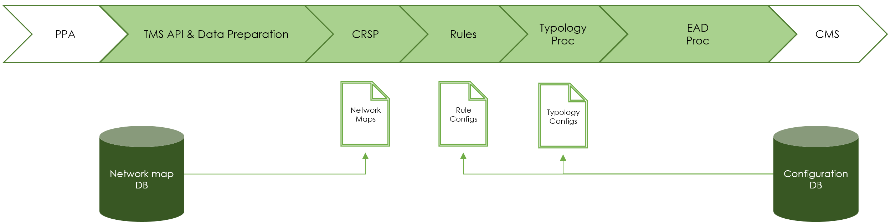

# Typologies, Rules and Rule configs

## Introduction  

The following information is based on the information taken from the [Tazama documentation](https://frmscoe.atlassian.net/wiki/spaces/FRMS/pages/76906497/Configuration+management).

## Assessing Financial crime

A Typology is a way of identifying a specific financial crime. Each Financial crime can be identified by the assessment of a number of rules, and then the combined impact of all these rules.

## Rules and their configurations

Imagine a Scenario where we have 4 rules, each rule has three configurations - a configuration is a different set of criteria used for assesment. This can be either differing exit criteria, or a specified case being seen or a result in a defined band.

```bash
rule-001/  
├── rule-001-config-1/  
├── rule-001-config-2/  
└── rule-001-config-3/  
rule-002/  
├── rule-002-config-1/  
├── rule-002-config-2/  
└── rule-002-config-3/  
rule-003/  
├── rule-003-config-1/  
├── rule-003-config-2/  
└── rule-003-config-3/  
rule-004/  
├── rule-004-config-1/  
├── rule-004-config-2/  
└── rule-004-config-3/  
```

We can then assign a rule and a configuration to help detect a specific Financial crime

```bash
Typology-001/  
├── rule-001/  
│   └── rule-001-config-1/  
└── rule-004/  
    ├── rule-004-config-2/  
    └── rule-004-config-3/  

Typology-002/  
├── rule-002/  
│   ├── rule-002-config-1/  
│   └── rule-002-config-2/  
├── rule-003/  
│   └── rule-003-config-2/  
└── rule-004/  
    ├── rule-004-config-2/  
    └── rule-004-config-3/  

Typology-003/  
├── rule-001/  
│   └── rule-001-config-3/  
├── rule-002/  
│   ├── rule-002-config-1/  
│   └── rule-002-config-3/  
└── rule-003/  
   └── rule-003-config-1/  

Typology-004/  
├── rule-003/  
│   └── rule-003-config-3/  
└── rule-004/  
    └── rule-004-config-1/  
```

This approach allows us to have a small number of rules but a variety of possible assessments, just by modifying configuration files.

## Routing an event

For the operational functioning of Tazama, each event type has a Network Map that is used to send the event for assessment using the above structure.

The following is an example network map.

```json

{
  "active": true,
  "cfg": "1.0.0",
  "messages": [
    {
      "id": "004@1.0.0",
      "host": "NATS Server",
      "cfg": "1.0.0",
      "txTp": "pacs.002.001.12",
      "channels": [
        {
          "id": "001@1.0.0",
          "host": "NATS Server",
          "cfg": "1.0.0",
          "typologies": [
            {
              "id": "typology-processor@1.0.0",
              "host": "NATS Server",
              "cfg": "001@1.0.0",
              "rules": [
                {
                  "id": "006@1.0.0",
                  "host": "RuleRequest006",
                  "cfg": "1.0.0"
                },
                {
                  "id": "078@1.0.0",
                  "host": "RuleRequest078",
                  "cfg": "1.0.0"
                }
              ]
            }
          ]
        }
      ]
    }
  ]
}
```

## The files in action for Tazama

All the above components are stored in Arango and leveraged by Tazama


