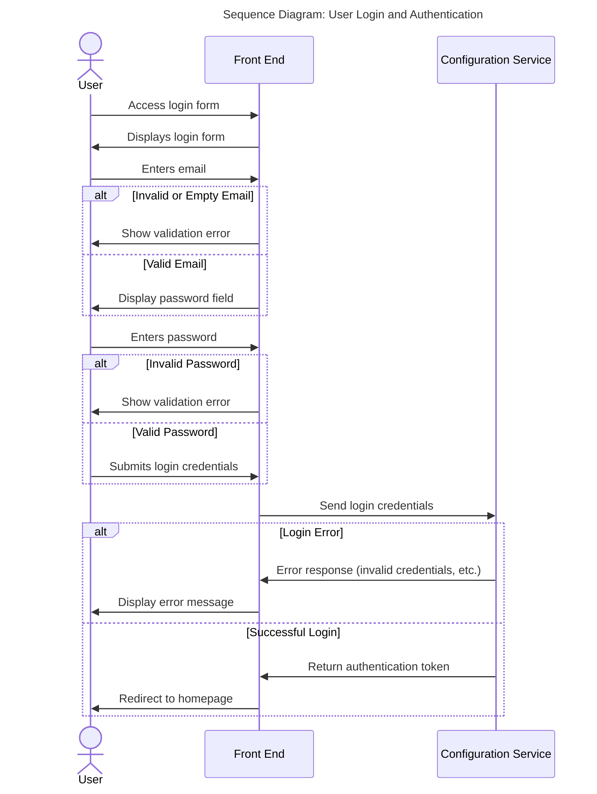

<!-- SPDX-License-Identifier: Apache-2.0 -->
# Login sequence and security

## Introduction

To authenticate to the service, we will use the Mojaloop vNext Security Bounded Context as well as it's portal. Once a user has authenticated, every page and service will require the authentication to ensure that no data can be entered by anyone other than the authorised user.

If a page is left for more than an admin configurable time (default 5 minutes), a user will be logged out. Any page content will be cleared and the user must re-authenticate to continue.

## Login

The user is presented with a two step login form. The user first enters their email address which is validated. If valid, the screen will change to allow a user to enter a password, which is also validated.

When the password is valid both the email address and password will be submitted to the back end for authentication. On error a message will be displayed for the user detailing the error. If the error is because of invalid credentials they will be prompted to try again with the correct details.

On success an authentication token will be returned from the security BC and stored in the browser's local storage. The user will be redirected to the homepage.

