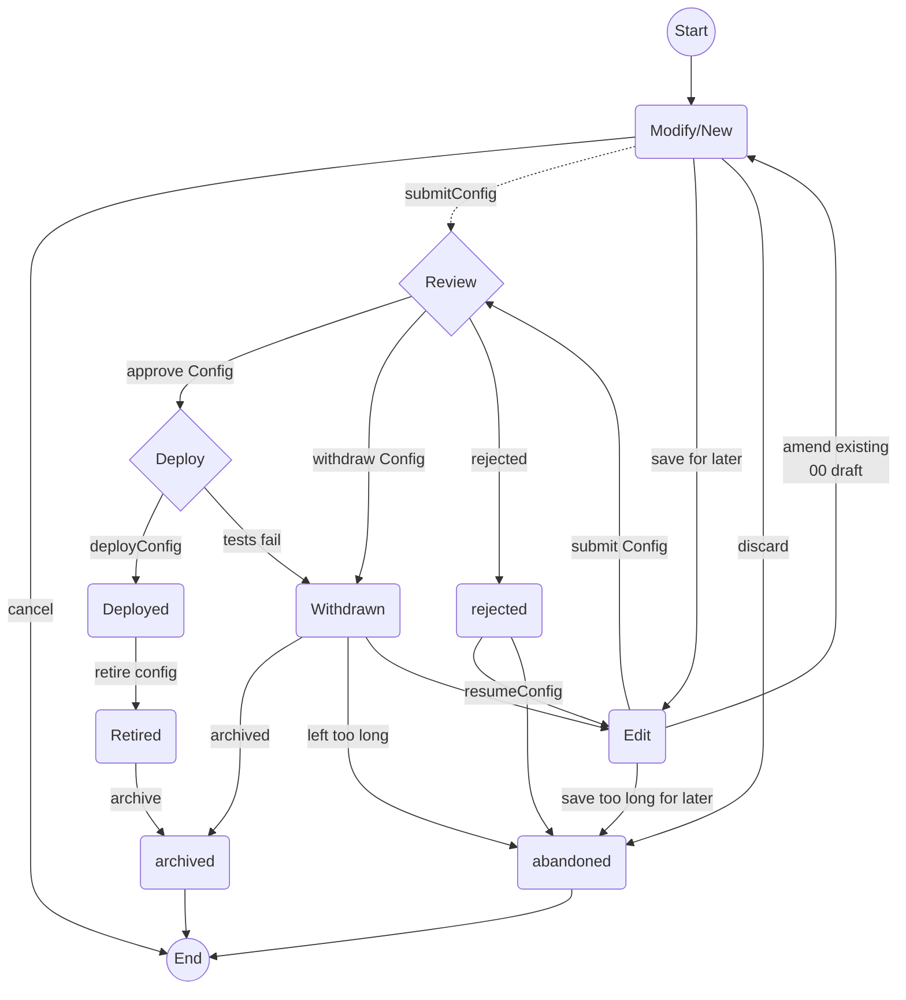

<!-- SPDX-License-Identifier: Apache-2.0 -->
# Stages and Artefact will follow during its lifecycle

## Introduction

All artefacts will follow a similar process for creation, review and design before deployment - that is summarised in the following diagram.

## Artefact Lifecycle Stages

