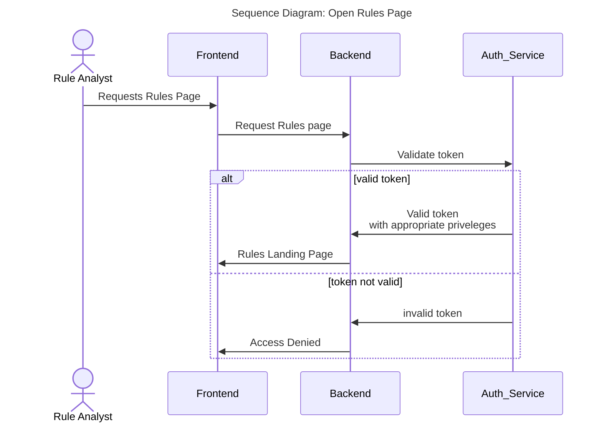
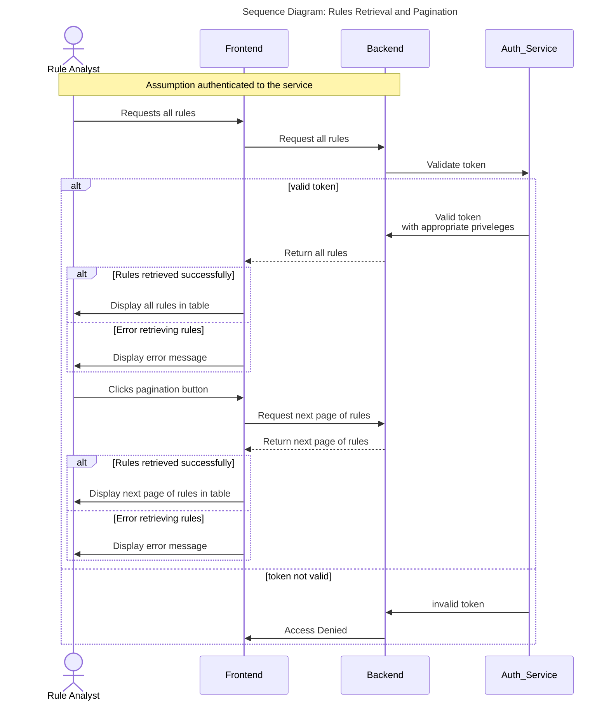
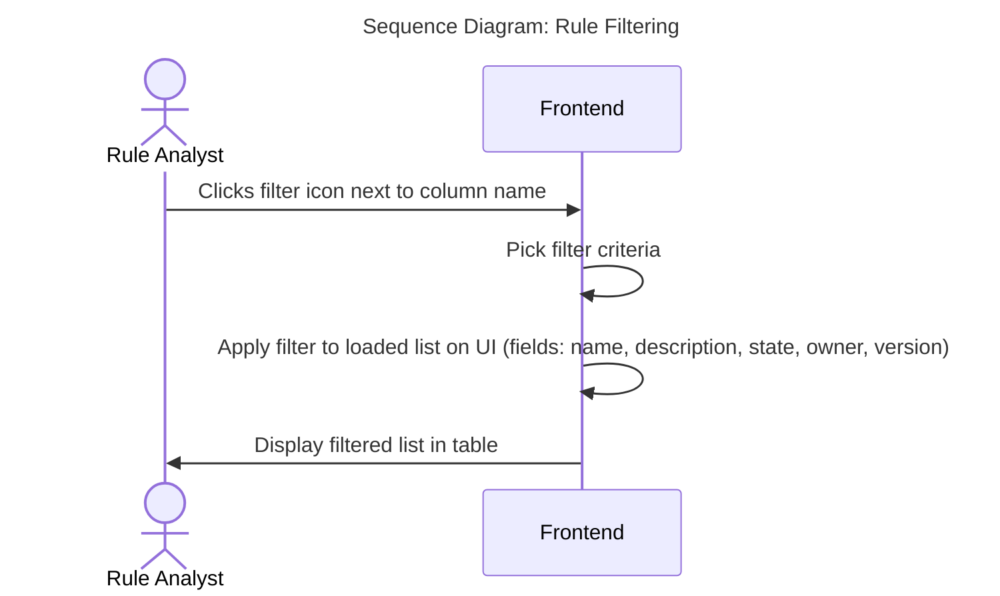
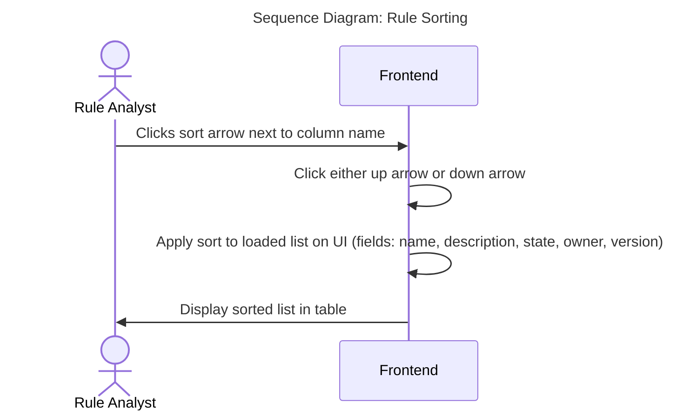

# Rules

## Introduction

Once a user has been authenticated via the login service, the user should be able to view the list of rules returned from the backend service.  
The user cannot access this page without being logged in.  
The user cannot access this page without being authorised in.  
The user is be able to view, sort and filter any of the following fields  

- Name
- Description
- Version
- Owner
- State

### Open Rules Page

### View List of rules

The service allows the user to view all rules from the backend assuming the have appropriate privileges

### Filter List of rules

User  filter rules currently displayed in the table

### Sort List of rules

