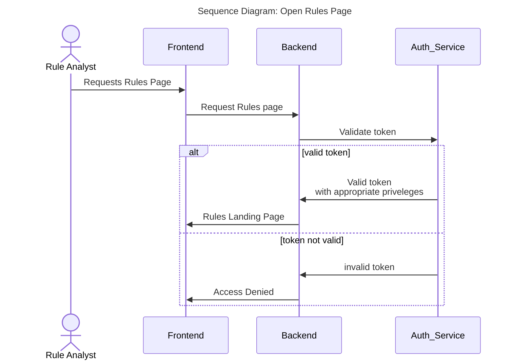
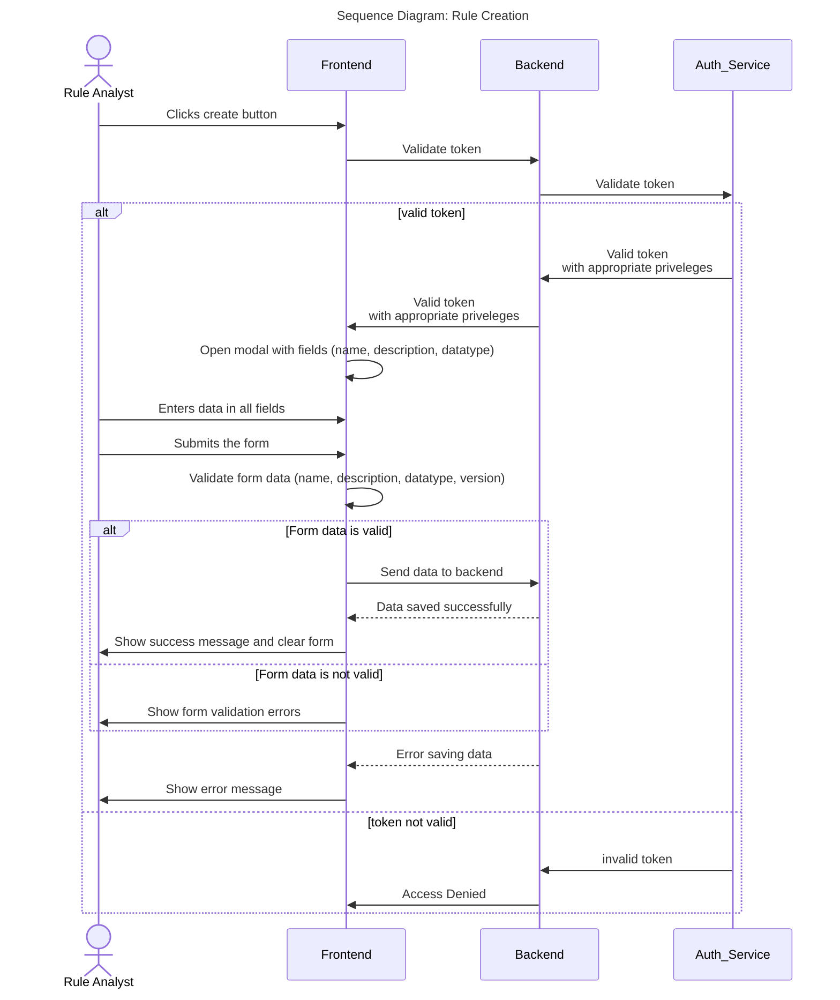
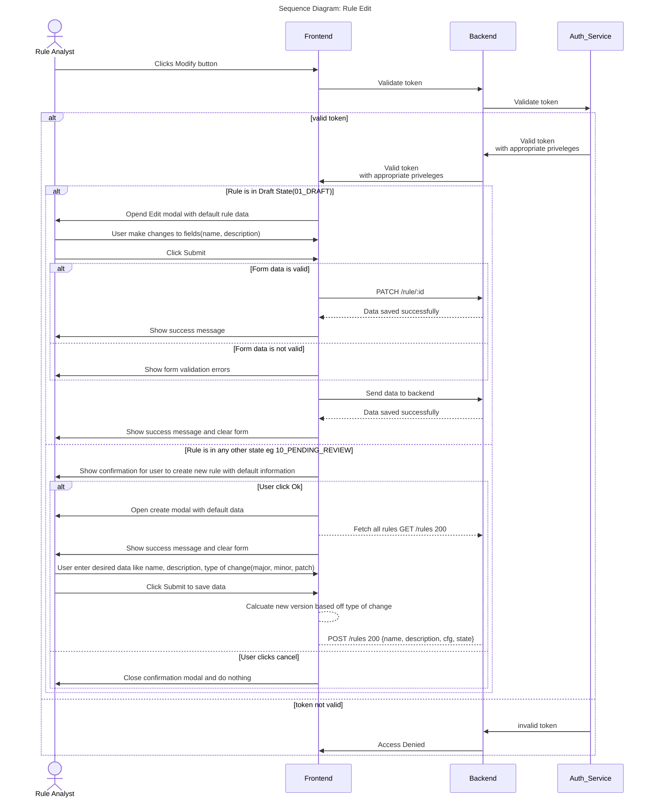

# Create and Edit Rules

## Introduction

Once a user has been authenticated via the login service, the user should be able to view the list of rules returned from the backend service.  
The user cannot access this page without being logged in.  
The user cannot access this page without being authorised in.  
The user is be able to view, sort and filter any of the following fields  

- Name
- Description
- Version
- Owner
- State

### Open Rules Page  

### Create Rule  

### Edit Rule  

