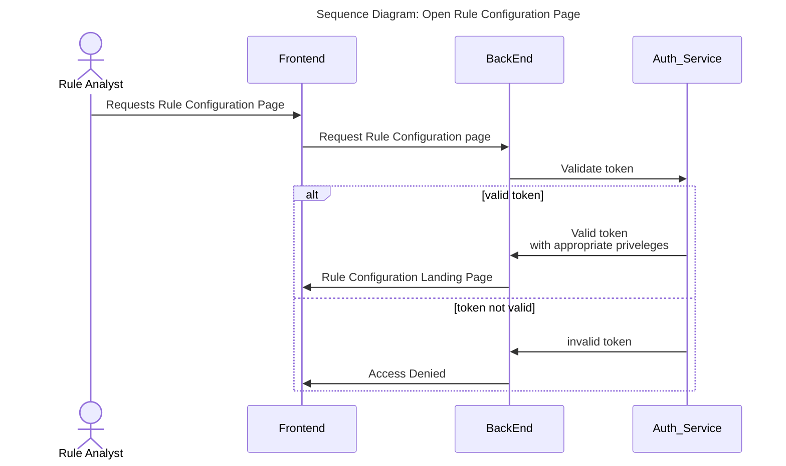
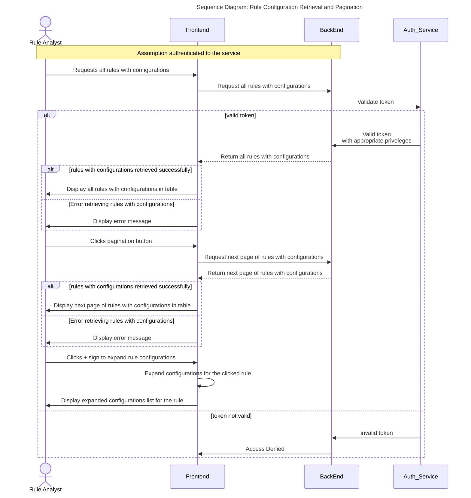
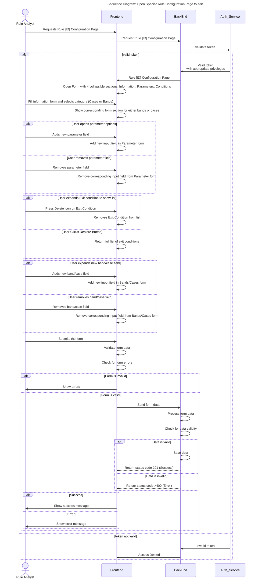
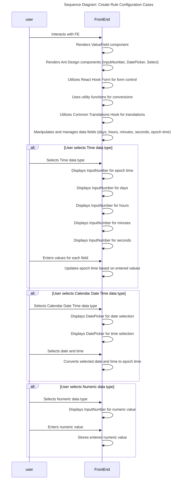
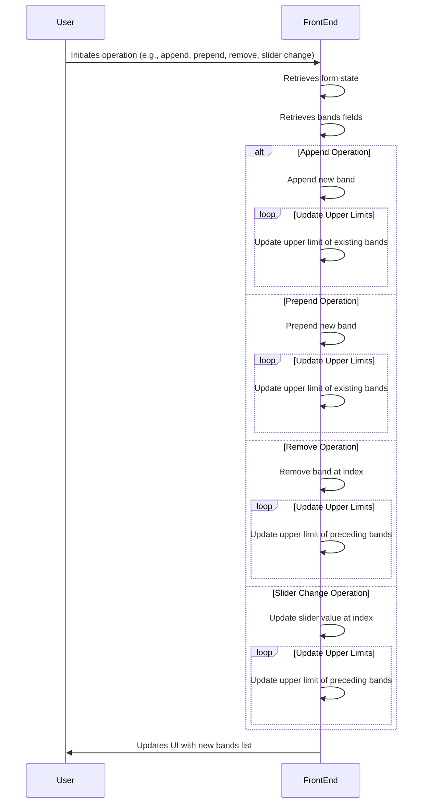

# Rule Configuration

## Introduction

Once a user has been authenticated via the login service, the user should be able to view the list of rules with configuration returned from the BE service. 
The user cannot access this page without being logged in.  
The can be able to view, sort and filter any of the following fields  

- Name
- Description
- Version
- Owner
- State
- rule configurations

### Open Rule Configuration Page

### View List of rules with configurations

The service allows the user to view all rules from the BE assuming the have appropriate privileges

### Create Config

#### Create rule configuration Cases

#### Band Configuration

