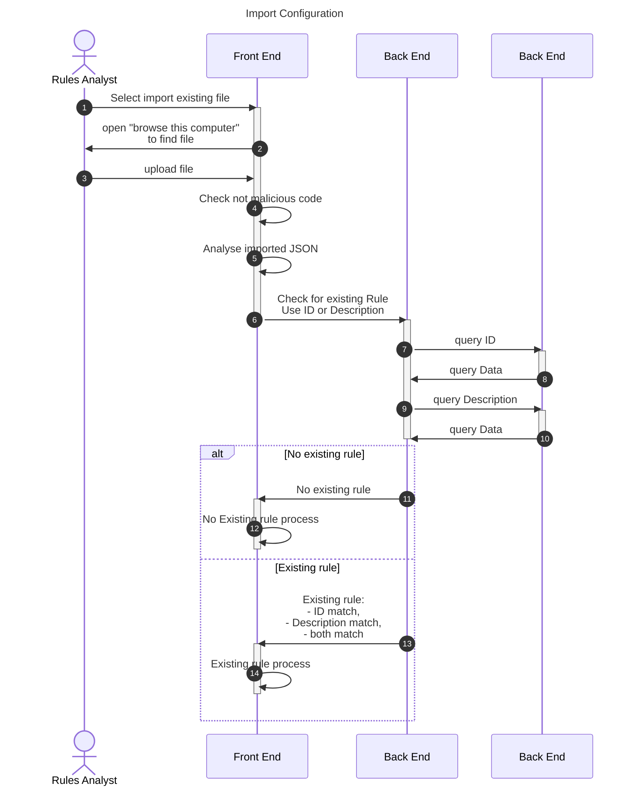
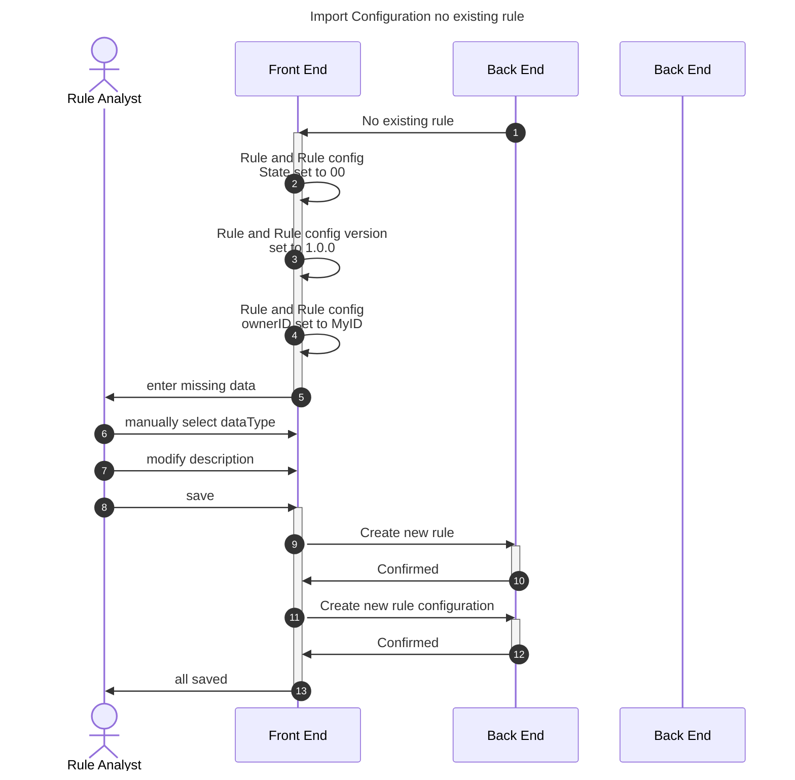
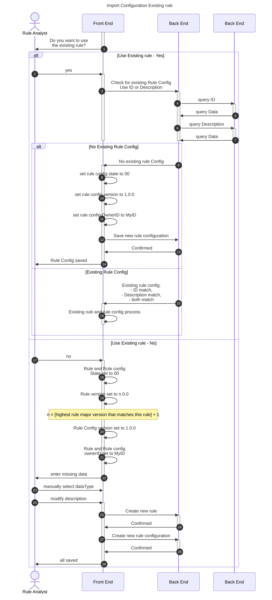
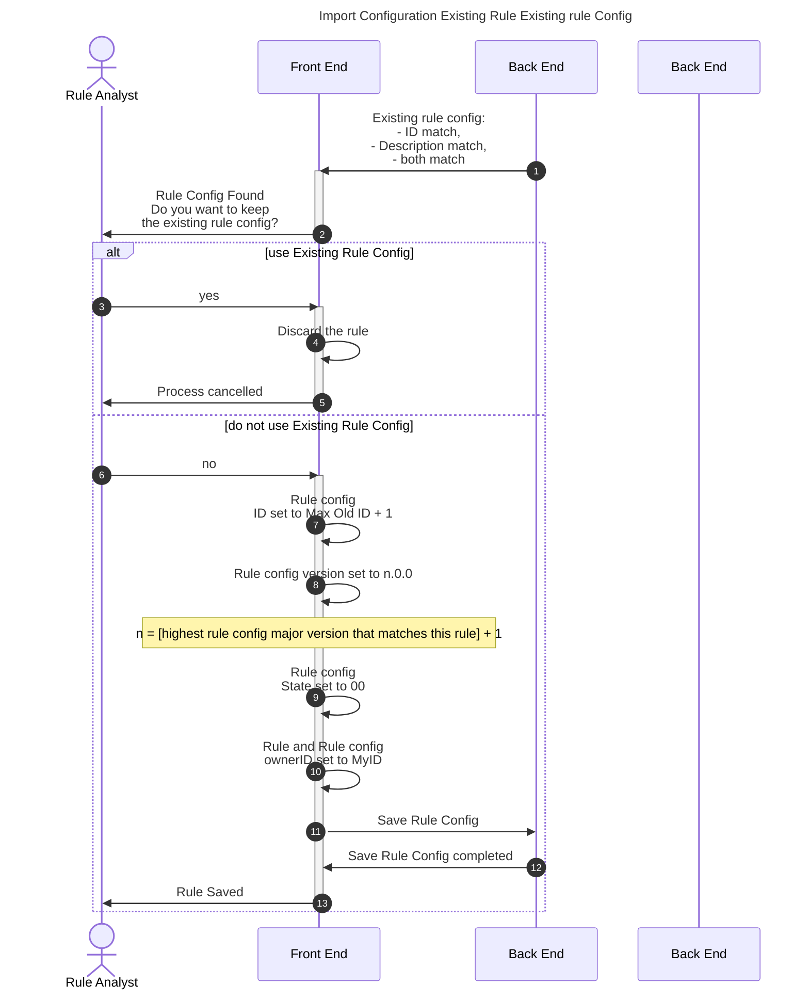

---  
sidebar_position: 2  
sidebar_label: import rule config
title: Import an existing rule configuration
date: 2023-11-17 08:41:28
author: Rob Reeve
---  

## Introduction

As the platform allows for sharing of typologies, it is possible that rules and their configuration files might be shared from one deployment to another. Because of this we need the ability to import the files in to the platform.

## Simple Import

## No existing rule Process

## Existing Rule

### Existing Rule and Rule Config

(c) LexTego ltd 2021-2024