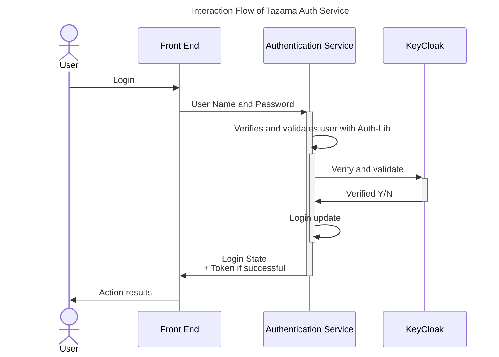
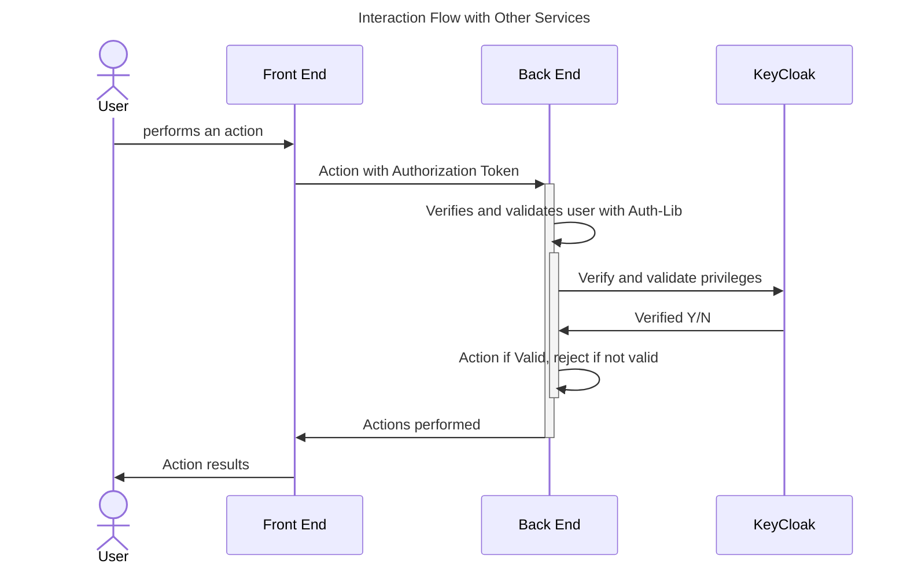
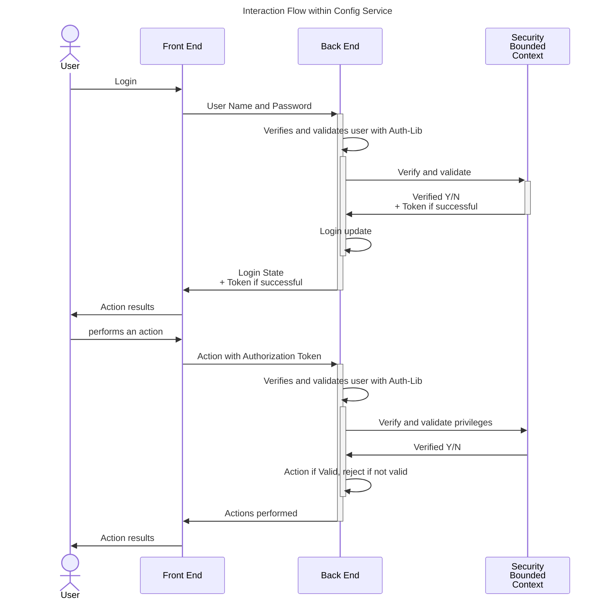
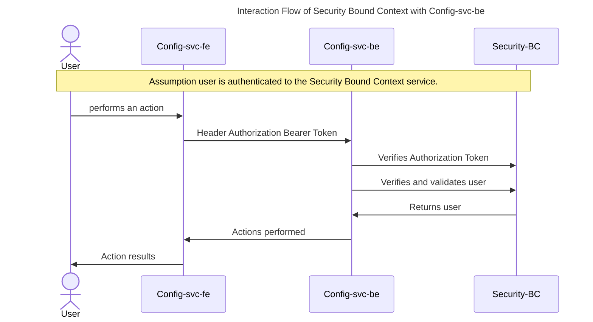

# Migration from vNext Security BC to Tazama Services  

The current integration approach for the Configuration Service is documented in the document: [login with security bc](../../login_with_security_bc.md), but key elements have been replicated here to help define the migration to the Tazama Authentication service

## Understanding the Tazama authentication service

At time of writing the documentation of Tazama is not finalised, so we have attempted to distill the actual services and their functions - but this needs to be confirmed by Tazama and the final documentation completed, then this section will reference that documentation.

Tazama have made two repositories available:

- Tazama Authorisation Service
- Tazama Auth-Lib

### Authorisation Service

The **Authorisation Service** is anticipated to be a standalone service that can be interacted with for shared services. For example, a shared login function. The Authorisation service has the Auth-Lib deployed to provide the abstraction.  

### Using Auth Lib

The **Auth-Lib** is a library that will create the abstraction layer to the underlying security service provider. This library will be deployed with any given service that requires functionality from the Authentication service, and abstraction is required.

Once a user is authenticated, they no longer need to talk to the Authentication service, directly, the Auth-Lib will be interacted with as a direct component of the back end that is deployed. With several services cached, to reduce unnecessary network traffic.

## Use of the Configuration Service

As the Configuration Service was designed and built before other services, and was a standalone service, there is not an independent login service, instead all messaages are passed through the configuration service.

## Migration plan

For speed of delivery, and to support the assessment of the UI, with the Configuration Service integrated with the Tazama Services and the use of Key Cloak, the delivery will be split into 2 phases:

1. Replace the code that supports and maintains the Security BC and replace it with the functionalities exposed by Auth-Lib
2. Adjust the Front end code that needs to leverage the Tazama Authentication service directly (i.e. Login)

This approach allows us to leverage the existing coding flows in the Configuration Service, and once full functionality is available in the Auth-Lib and Auth Service a small code change is required to leverage the desired architecture.

To facilitate the successful migration, new functionality is required from the Auth-Lib. This is documented in [services required](02_services_required_from_auth_lib.md)

## Background of the Mojaloop vNext Security BC

The Configuration service uses the following functions exposed by the Security BC

- setUserCredentials - passing the user credentials and the client_id of the app being used by the user
- setAppCredentials - passing the app credentials
- setToken - setting a previously obtained access token.
- getToken(): Promise<AuthToken>;
- roleHasPrivilege(roleId: string, privilegeId: string): boolean;
- rolesHavePrivilege(roleIds: string[], privilegeId: string): boolean;
- addPrivilege(privId: string, labelName: string, description: string): void;
- addPrivilegesArray(privsArray: { privId: string, labelName: string, description: string }[]): void;

### Interaction Flow of Security Bound Context with Config-svc-be

