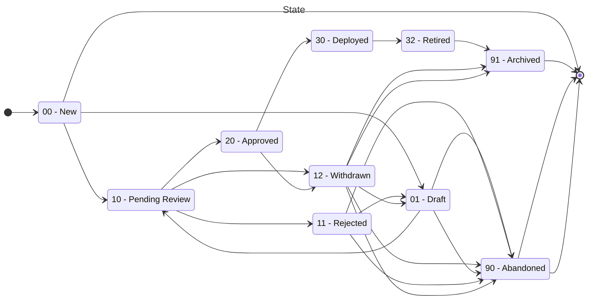

<!-- SPDX-License-Identifier: Apache-2.0 -->
# State Machine Design Spike

## Introduction

As the various artefacts move through different stages of deployment, their state is updated, until such time as they are either archived or abandoned. Different processes will ensure that only authorised parties move artefacts between the states, and as they are moved, all these changes are captured in an auditable log.

## States

## Problem

The configuration service needs to manage the state of the configuration objects such as rule, rule config and typology.

The state transitions of the configuration objects are complex and involve multiple states and actions, such as approval, rejection, withdrawal, and archival.

Currently configuration service does not provide a structured way to manage the state of configuration objects, leading to issues with state consistency, reliability, and predictability.

The team needs to design a solution to manage the state of configuration objects effectively, ensuring that they transition through states correctly and handle various scenarios such as approval, rejection, and archival.

## Solution

To manage the state of the configuration objects, we will implement a state machine in the backend.

### Why State Machines Are Suitable for Configuration Objects

**Defined State Transitions**: The Configuration Service application involves managing rules, rule configs and other object with clearly defined state transitions (New, Draft, Pending Review, Approved, etc.). A state machine is ideal for this because it allows you to explicitly define allowable transitions between states in a predictable and managed way.

**Complex State Logic**: The complexity of the state logic, which includes various paths depending on actions like approval, rejection, withdrawal, and archival, fits well with the hierarchical (nested) state capabilities of state machines. This encapsulate complex logic within states and handle various scenarios in a structured manner.

**Determinism**: Configuration Service operations need to be deterministic and reliable. Using a state machine ensures that the application behaves as expected, transitioning through states based on defined rules without unexpected outcomes.

### Options Considered

We considered using a simple state management approach without a state machine. However, this approach would not provide the level of structure, predictability, and reliability that a state machine offers.

We also considered using a different state machine library, such as

- [machina](https://github.com/ifandelse/machina.js)
- [statejs](https://github.com/nickfargo/state)
- [javascript-state-machine](https://github.com/jakesgordon/javascript-state-machine)
- [xstate](https://github.com/statelyai/xstate)

### Comparison of State Machine Libraries

| Feature                   | machina.js                              | state.js                       | javascript-state-machine                | xstate                                            |
| ------------------------- | --------------------------------------- | ------------------------------ | --------------------------------------- | ------------------------------------------------- |
| **Documentation**         | Good                                    | Minimal, basic                 | Well-detailed                           | Extensive, with tutorials and visual tools        |
| **Ease of Use**           | Moderate                                | Moderate                       | Easy                                    | Moderate to high, depending on use case           |
| **Features**              | Hierarchical states, multiple instances | Basic state management         | Finite states, asynchronous transitions | Hierarchical, parallel, historical states, actors |
| **Maintenance**           | Less frequent updates                   | Last update 11 years ago       | Last update 6 years ago                 | Highly active, regularly updated                  |
| **Popularity**            | Medium                                  | Low                            | High, widely used                       | Very high, widely adopted in industry             |
| **Visual Tools**          | None                                    | None                           | None                                    | Comprehensive (Statecharts, XState Viz)           |
| **Community and Support** | Smaller community                       | Very limited community support | Large community, good support           | Very large community, extensive support channels  |
| **TypeScript Support**    | Basic                                   | Limited                        | Good                                    | Excellent                                         |

While all libraries provide the basic functionality for state management, `xstate` stands out with its comprehensive feature set, excellent documentation, active maintenance, and strong community support, making it highly suitable for complex applications that require robust state management solutions.

## Proposal

Given the complexity of the state logic and the need for a robust and reliable solution, we propose to use the **xstate** library to implement a state machine in the backend for managing the state of configuration objects.

The xstate library provides a robust and feature-rich state machine implementation that is widely used in backend applications. It offers hierarchical (nested) states, parallel states, guards, actions, and more, which will help us model the complex state logic of the configuration objects effectively.

### Benefits of Using a _xstate_ State Machine

The use of xstate state machine in the backend will provide the following benefits:

- **Structured State Management**: The state machine will provide a structured way to manage the state of configuration objects, ensuring that they transition through states predictably and reliably.
- **Clear State Logic**: The state machine will encapsulate the state logic of configuration objects, making it easier to understand and maintain the codebase.
- **Deterministic Behavior**: The state machine will ensure that the application behaves deterministically, transitioning through states based on defined rules without unexpected outcomes.
- **Visual Clarity**: The state machine can be visualized using state chart diagrams, providing a clear representation of state transitions and helping with debugging and testing.
- **Reusability**: The state machine can be reused for other parts of the application that require state management, reducing duplication and improving consistency.
- **Scalability**: The state machine can handle complex state logic and edge cases effectively, making it suitable for scaling the application as needed.
- **Community Support**: The xstate library has a large community and active development, providing ongoing support and updates for the state machine implementation.

## Implementation Plan

The implementation of the state machine in the backend will follow these steps:

1. **Design State Machine**: Define the states, events, transitions, and actions for the state machine based on the state logic of configuration objects.
2. **Implement State Machine**: Use the xstate library to implement the state machine in the backend, integrating it with the existing codebase.
3. **Test State Machine**: Write unit tests and integration tests to validate the behavior of the state machine and ensure that it transitions through states correctly.
4. **Integrate State Machine**: Integrate the state machine with the configuration service API endpoints to manage the state of configuration objects.
5. **Update Documentation**: Update the documentation to reflect the state machine implementation and provide guidelines for working with the state machine.
6. **Review and Refactor**: Review the state machine implementation with the team, gather feedback, and refactor the code as needed to improve readability, maintainability, and performance.
7. **Deploy State Machine**: Deploy the state machine to the development, staging, and production environments, ensuring that it works as expected in different scenarios.
8. **Monitor and Maintain**: Monitor the state machine in production, handle any issues or errors that arise, and maintain the state machine as needed to keep it up to date with the application requirements.
