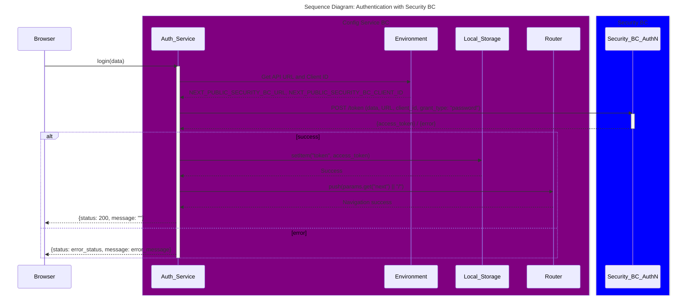

<!-- SPDX-License-Identifier: Apache-2.0 -->
# Login with Security BC

## Authentication with Mojaloop Security BC

The user will be authenticated with the Security BC. The user will be required to enter their email address and password. The Security BC will validate the user against the security bounded context and then return a token to the user. This token will be used to authenticate the user for all future requests to the config service back end, until such time as it expires.

