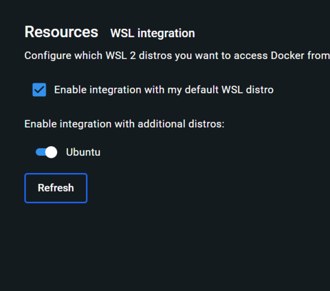

# Platform Shared Tools Deployment

This guide provides step-by-step instructions for deploying the Mojaloop Platform Shared Tools currently used by the Configuration Service to create a reference installation for the Mojaloop vNext project.

> ⚠️ Important Note: These instructions are primarily for MacBook (macOS) users, but they should also be applicable for Linux and Windows Subsystem for Linux (WSL2) environments. If you encounter any issues, or if any commands do not work for you, please create an issue to provide feedback or request assistance. The deployment has been tested on a WSL2 installation.

## 1. Cloning the Mojaloop Platform Shared Tools Repository

We are going to deploy all code in a code directory, under your home - please adapt the instructions according to your specific requirements.

First, navigate to the [Mojaloop Platform Shared Tools Repo](https://github.com/mojaloop/platform-shared-tools/tree/main).

Next, clone the repository into your code directory using the following command in your terminal:

```shell
  git clone https://github.com/mojaloop/platform-shared-tools --branch beta1
```

## 2. Building Kafka, ElasticSearch and MongoDB for local infrastructure

> ⚠️ Important Note: The following instructions have been directly copied from the original Mojaloop [docker-compose-infra/README.md](https://github.com/mojaloop/platform-shared-tools/blob/main/packages/deployment/docker-compose-infra/README.md) if you want to review. Please adhere to the steps provided below. If you encounter any issues, or if any commands do not function as expected, please create an issue to provide feedback or request assistance.

> ⚠️ Important Note: Before proceeding, please ensure you navigate to the `docker-compose-infra` directory in your terminal:

```shell
  cd platform-shared-tools/packages/deployment/docker-compose-infra
```

Proceed with the following instructions:

### Platform Tools - Docker Compose for Infrastructure Services

Note: for Windows specific tips see this [readme](https://github.com/mojaloop/platform-shared-tools/blob/main/packages/deployment/README_WIN.md)

### Setup Infrastructure Containers

To startup Kafka, MongoDB, Elasticsearch and Kibana, follow the steps below:

1. Create a directory called `exec` inside the `docker-compose-infra` (this) directory, and go to that directory.

_This `exec` directory is ignored by gitignore, so can't be pushed to GitHub._

```shell
  mkdir exec
  cd exec
```

2. Create the following directories as children of the `docker-compose/exec` directory:

- `certs`
- `esdata01`
- `kibanadata`
- `logs`
- `mongodb_data`
- `grafana_data`
- `prometheus_data`
- `prometheus_etc`

```shell
  mkdir {certs,esdata01,kibanadata,logs,mongodb_data,grafana_data,prometheus_data,prometheus_etc}
```

Note: For Mac users you might have to grant full access to these directories, to do that execute in the exec directory:

```shell
sudo chmod -R 777 .
```

3. Copy the `.env.sample` to the exec dir:

```shell
cp ../.env.sample ./.env
```

4. Copy Prometheus and Grafana's files to the correspondent data directories:

```shell
cp ../prometheus.yml ./prometheus_etc/prometheus.yml
cp ../grafana_datasources.yml ./grafana_data/datasource.yml
```

5. Review the contents of the .env file using your preferred editing tool.

- For macOS: Update the ROOT_VOLUME_DEVICE_PATH to reflect the absolute path.
- For Windows WSL:

  - Avoid using the Windows mnt drive for defining paths.
  - Ensure the path is fully expressed and correctly formatted for WSL environments.
  - It's important to enable integration with your default WSL distro under your Docker settings. Additionally, ensure all distros that will be used are included. For instance, if Ubuntu is not enabled by default but WSL is, and it's the only distro you have, make sure Ubuntu is specifically enabled.

    

6. Ensure `vm.max_map_count` is set to at least `262144`: Example to apply property on live system:

```shell
sysctl -w vm.max_map_count=262144 # might require sudo
```

### Start Infrastructure Containers

Start the docker containers using docker compose up (in the exec dir)

```shell
docker compose -f ../docker-compose-infra.yml --env-file ./.env up -d
# OR for older versions of docker
docker-compose -f ../docker-compose-infra.yml --env-file ./.env up -d
```

To view the logs of the infrastructure containers, run:

```shell
docker compose -f ../docker-compose-infra.yml --env-file ./.env logs -f
# OR for older versions of docker
docker-compose -f ../docker-compose-infra.yml --env-file ./.env logs -f
```

To stop the infrastructure containers, run:

```shell
docker compose -f ../docker-compose-infra.yml --env-file ./.env stop
# OR for older versions of docker
docker-compose -f ../docker-compose-infra.yml --env-file ./.env stop
```

### Viewing the dashboards

If you wish to view the dashboards, please proceed to the [Viewing the dashboards](https://github.com/mojaloop/platform-shared-tools/blob/main/packages/deployment/docker-compose-infra/README.md#viewing-the-dashboards) section and follow the instructions provided there.

## 3. Building Security, Platform Configuration Service, Logging and Auditing Cross-cutting Concerns

> ⚠️ Important Note: The following instructions have been directly copied from the original Mojaloop [docker-compose-cross-cutting/README.md](https://github.com/mojaloop/platform-shared-tools/blob/main/packages/deployment/docker-compose-cross-cutting/README.md) if you want to review. Please adhere to the steps provided below. If you encounter any issues, or if any commands do not function as expected, please create an issue to provide feedback or request assistance.

> ⚠️ Important Note: Before proceeding, please ensure you navigate to the `docker-compose-cross-cutting` directory in your terminal (it is assumed you are still in the docker-compose-infra/exec directory):

```shell
  cd ../../docker-compose-cross-cutting
```

Proceed with the following instructions:

### Platform Tools - Docker Compose for Cross-Cutting Concerns Services

**Note:** Make sure all infrastructure containers are running, see docker-compose-infra directory.

1. Create a directory called `exec` inside the `docker-compose-cross-cutting` (this) directory, and go to that directory.

_This `exec` directory is ignored by gitignore, so can't be pushed to GitHub._

```shell
mkdir exec
cd exec
```

2. Create the following directories as children of the `docker-compose-cross-cutting/exec` directory:

- `data`

```shell
mkdir data
```

3. Create the following directories as children of the newly created `data` directory:

- authentication-svc
- authorization-svc
- platform-configuration-svc
- auditing-svc
- logging-svc

```shell
mkdir {data/authentication-svc,data/authorization-svc,data/platform-configuration-svc,data/auditing-svc,data/logging-svc}
```

Note: For Mac users you might have to grant full access to these directories, to do that execute in the exec directory:

```shell
sudo chmod -R 777 data
```

4. Copy the `.env.sample` to the exec dir:

```shell
cp ../.env.sample ./.env
```

5. Review the contents of the `.env` file. **If using MacOS update the ROOT_VOLUME_DEVICE_PATH to reflect the absolute path**

### Start Cross-Cutting Concern Service Containers

Start the docker containers using docker compose up (in the exec dir)

```shell
docker compose -f ../docker-compose-cross-cutting.yml --env-file ./.env up -d
# OR for older versions of docker
docker-compose -f ../docker-compose-cross-cutting.yml --env-file ./.env up -d
```

> ⚠️ Important Note: After executing the command `docker compose -f ../docker-compose-cross-cutting.yml --env-file ./.env up -d`, the platform-configuration-svc did not start due to an error, as illustrated in the screenshot below. However, the platform-configuration-svc can be manually started afterwards.


To view the logs of the infrastructure containers, run:

```shell
docker compose -f ../docker-compose-cross-cutting.yml --env-file ./.env logs -f
# OR for older versions of docker
docker-compose -f ../docker-compose-cross-cutting.yml --env-file ./.env logs -f
```

To stop the infrastructure containers, run:

```shell
docker compose -f ../docker-compose-cross-cutting.yml --env-file ./.env stop
# OR for older versions of docker
docker-compose -f ../docker-compose-cross-cutting.yml --env-file ./.env stop
```

## 4. Pre built requests and tester tools

If you wish to test the tools, please proceed to the [Pre built requests and tester tools](https://github.com/mojaloop/platform-shared-tools/tree/main?tab=readme-ov-file#pre-built-requests-and-tester-tools) section and follow the instructions provided there.

## 5. Deploy Mojaloop vNext Admin UI

The Mojaloop vNext Admin UI enables interaction with the Security BC.

> Note: Make sure all Infra containers and Cross-cutting containers are running, see `docker-compose-infra directory` and `docker-compose-cross-cutting` directory for further information.

> ⚠️ Important Note: Before proceeding, ensure you navigate to the admin-ui directory in your terminal (it is assumed you are still in the docker-compose-cross-cutting/exec directory)::

```shell
cd ../../../admin-ui
```

> ⚠️ Important Note: The following instructions have been directly copied from the original Mojaloop [admin-ui/README.md](https://github.com/mojaloop/platform-shared-tools/blob/main/packages/admin-ui/README.md) if you want to review. Please adhere to the steps provided below. If you encounter any issues, or if any commands do not function as expected, please create an issue to provide feedback or request assistance.

### Mojaloop vNext admin UI

### Install

See notes in root dir of this repository
More information on how to install NVM: https://github.com/nvm-sh/nvm

#### 1. Use correct Node.js version

```shell
nvm use
```

(in the project directory)

#### 2. Install

```shell
npm install
```

#### 3. How to start the web app

##### Start the local development server

In the root directory of the project (which contains the file "package.json"):

```shell
npm start
```

##### Open the application in the browser

At this time a browser can be pointed to [http://localhost:4200/](http://localhost:4200/) to start the application.

#### 4. Login

Try these default development credentials:

- user - superPass
- admin - superMegaPass

#### 5. Troubleshooting Startup Issues

- opensslErrorStack (Only for node 18 and above versions) :
  - WINDOWS : On the terminal enter : `export export NODE_OPTIONS=--openssl-legacy-provider`
  - UNIX : On the terminal : `unset NODE_OPTIONS`

## 6. Addition information for Security BC

### Default user for Security BC

```text
Please note the Default users:

1.
username: user
password: superPass

2.
username: admin
password: superMegaPass
```

#### Use the existing AdminUI to see how the security apis are being used currently

Please navigate to the following link -> [platform-shared-tools/packages/admin-ui](https://github.com/mojaloop/platform-shared-tools/tree/main/packages/admin-ui)

(c) LexTego ltd 2021-2024
