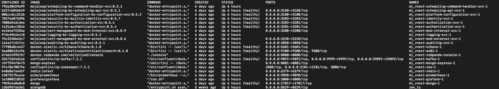
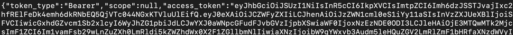

# Configuration Service Back End Deployment

## Introduction

The Configuration Service Backend is a restful service for Tazama to allow for the creation of the configuration files used by the Tazama Transaction Monitoring Services

More information on the components used are available here:

- [NodeJS](https://nodejs.org/en/)
- [NestJS](https://nestjs.com/)
- [Arangodb](https://arangodb.com/)

## Installation

### Requirements

Before you get started, the following need to be installed:

- **[NodeJS](https://nodejs.org/en/)**. **_Version 20.10_** and above is currently used and we don't guarantee everything works with other versions. If you need to work with multiple versions of NodeJS, [NVM](https://github.com/nvm-sh/nvm/blob/master/README.md) is recommended.
- **[NestJS](https://nestjs.com/)**. **_Version 10.0.0_** is currently used to build our restful service. We don't guarantee everything works with other versions.
- **[npm](https://www.npmjs.com/)**. We are currently using npm to manage our dependancies.

#### Additional Requirements for Linux Users

If you are developing on a Linux-based system, you will also need to install build tools to compile native addons used by Node.js. For Debian-based systems (such as Ubuntu), run the following commands:

```bash
sudo apt update
sudo apt install build-essential
```

### Pre-requisites

It is assumed that you have installed Mojaloop Security BC and associated services. If you have not, please do so before continuing. Instruction and documentation are available [here](../../docs/deployment/Mojaloop-Platform-Shared-Tools-Deployment.md)

## Clone the application

We are going to deploy all code in a code directory, under your home - please adapt the instructions according to your specific requirements.

Clone the repo

```bash
git clone git@github.com:frmscoe/config-service.git
```

cd into the repo

```bash
cd config-service/packages/config-svc-be
```

Use the correct Node.js version

```bash
nvm use
```

Install dependencies

```bash
npm install
```

Add environment variables

```bash
cp ./.env.sample ./.env
```

Any empty .env file should look as follows:

```t
# Security BC Connection
AUTH_N_SVC_BASEURL=
AUTHORIZATION_BASEURL=
KAFKA_URL=
AUTH_N_TOKEN_ISSUER_NAME=
AUTH_N_TOKEN_AUDIENCE=

# Application Configurations
SVC_CLIENT_ID=
SVC_CLIENT_SECRET=
BC_NAME=
APP_NAME=
APP_VERSION=

# Arango Database Connection.
DATABASE_HOST=
DATABASE_NAME=
SYSTEM_DATABASE_NAME=
DATABASE_USERNAME=
DATABASE_PASSWORD=

# Arango Database Connection for Testing.
DATABASE_NAME_TEST=

# config-svc-be application port
PORT=
```

If you use a default installation, your .env file should be as follows:

```t
# Security BC Connection.
AUTH_N_SVC_BASEURL=http://localhost:3201 # the mojaloop/security-bc-authorization-svc:0.5.4 image running in docker
AUTHORIZATION_BASEURL=http://localhost:3202 # the mojaloop/security-bc-authentication-svc:0.5.4 image running in docker
KAFKA_URL=localhost:9092 # the confluentinc/cp-kafka:7.2.1  image running in docker
AUTH_N_TOKEN_ISSUER_NAME=mojaloop.vnext.dev.default_issuer # default security-bc token authentication issuer name
AUTH_N_TOKEN_AUDIENCE=mojaloop.vnext.dev.default_audience # default security-bc token authentication audience

# Application Configurations
SVC_CLIENT_ID=config-svc-client-id # specifies the created application client id
SVC_CLIENT_SECRET=config-svc-secret # specifies created application client secret
BC_NAME=config-svc-bc # identifies the application privileges (they are variables)
APP_NAME=config-svc # identifies the application privileges (they are variables)
APP_VERSION=0.5.5 # this is a random version to version the privileges. it should from 0.5 on wards

# Arango Database Connection.
DATABASE_HOST=http://localhost:8529/ # the port specified in the -p 8529:8529
DATABASE_NAME=config-svc-db # the database name
SYSTEM_DATABASE_NAME=_system # the system database name
DATABASE_USERNAME=root # the database username specified in  the --server.username root:
DATABASE_PASSWORD=1 # the database password specified in the --server.password

# Arango Database Connection for Testing.
DATABASE_NAME_TEST=config-svc-db-test

# config-svc-be application port
PORT=3007 # specify the port on which you want to run the application (default port is 3007)
```

## Install ArangoDB with Docker

If you have not installed Arango, as part of another service, the recommended way of using it on a local machine is via docker according to the [documentation](https://docs.arangodb.com/3.11/operations/installation/docker/).

Please follow the [Install ArangoDB with Docker](../../docs/deployment/arangodb-fundamentals.md#install-arangodb-with-docker) instructions to create a ArangoDB instance.

### Update the Arango Database Connection environment variables as follows

```t
# Arango Database Connection.
DATABASE_HOST=http://localhost:8529/ # the port specified in the -p 8529:8529
DATABASE_NAME=config-svc-db # the database name
SYSTEM_DATABASE_NAME=_system # the system database name
DATABASE_USERNAME=root # the database username specified in  the --server.username root:
DATABASE_PASSWORD=1 # the database password specified in the --server.password

# Arango Database Connection for Testing.
DATABASE_NAME_TEST=config-svc-db-test
```

### Accessing Arango

Should you need to access the Arango Front End, you can use their [portal](http://localhost:8529/) the credentials we created above are as follows:

```t
UserName: root
Password: 1
```

## Deploying the Platform Shared Tools

Please follow the instructions in the [mojaloop platform shared tools deployment](https://github.com/lextego/config-svc/blob/main/docs/02-deployment/90-mojaloop-platform-shared-tools-deployment.md) readme to deploy the Mojaloop Platform Shared Tools

- In order to check the images with cli run

```bash
docker ps
```



Update the Mojaloop Platform Shared Tools environment variables as follows

```t
# Security BC Connection.
AUTH_N_SVC_BASEURL=http://localhost:3201 # the mojaloop/security-bc-authorization-svc:0.5.4 image running in docker
AUTHORIZATION_BASEURL=http://localhost:3202 # the mojaloop/security-bc-authentication-svc:0.5.4 image running in docker
KAFKA_URL=localhost:9092 # the confluentinc/cp-kafka:7.2.1  image running in docker
AUTH_N_TOKEN_ISSUER_NAME=mojaloop.vnext.dev.default_issuer # default security-bc token authentication issuer name
AUTH_N_TOKEN_AUDIENCE=mojaloop.vnext.dev.default_audience # default security-bc token authentication audience
```

## Configuration of the Security BC service

- Log into the authentication service of the security bounded context running <http://localhost:3201> (The Mojaloop/security-bc-authentication-svc:0.5.4 running in docker)using the default login credentials defined in [Mojaloop vNext admin UI](../../docs/deployment/Mojaloop-Platform-Shared-Tools-Deployment.md#install)

  ```bash
  curl --location 'http://localhost:3201/token' \
  --header 'Content-Type: application/json' \
  --data '{
      "grant_type": "password",
      "client_id": "security-bc-ui",
      "username": "admin",
      "password": "superMegaPass"
  }'
  ```

- The response contains an access_token to be used in creating an application
  
- Create an application using the endpoint <http://localhost:3203/> (the mojaloop/security-bc-builtin-identity-svc:0.5.7 image running in docker) that identifies the service by providing clientId and clientSecret as variables. In this we are going to use `config-svc-client-id` as our `clientId`, `config-svc-secret` as our `clientSecret` and update the Authorization bearer token with the newly obtained access token.

  ```bash
  curl --location 'http://localhost:3203/apps/' \
  --header 'Content-Type: application/json' \
  --header 'Authorization: Bearer <New_BearerTOKEN>' \
  --data '{
      "enabled": true,
      "clientId": "config-svc-client-id",
      "platformRoles": [],
      "clientSecret": "config-svc-secret",
      "canLogin": true
  }'
  ```

> Note: If you get an error `{"status":"error","msg":"Invalid client_id."}%`, it means the clientId already exists therefore provide a new clientId variable name.

- Assign the created application a basic role using the endpoint `http://localhost:3203/apps/${clientId}/roles/` providing the clientId as `config-svc-client-id` for created application.

  ```bash
  curl --location 'http://localhost:3203/apps/config-svc-client-id/roles/' \
  --header 'Content-Type: application/json' \
  --header 'Authorization: Bearer <New_BearerTOKEN>' \
  --data '[
      {
          "roleId": "basic-application"
      }
  ]'
  ```

Update the application configuration environment variables as follows depending on the created application

```t
# Application Configurations
SVC_CLIENT_ID=config-svc-client-id # specifies the created application client id
SVC_CLIENT_SECRET=config-svc-secret # specifies created application client secret
BC_NAME=config-svc-bc # identifies the application privileges (they are variables)
APP_NAME=config-svc # identifies the application privileges (they are variables)
APP_VERSION=0.5.5 # this is a random version to version the privileges. it should from 0.5 on wards
```

Update the config-svc-be application port (optional as it runs on a default port of 3007)

```t
# config-svc-be application port
PORT=3007 # specify the port on which you want to run the application (default port is 3007)
```

## Run the application

```bash
npm run start
```

Run the application on **hot-reload**

```bash
npm run start:dev
```

After running the application, we need to add the privileges of config-svc-be to the basic-application role.

Open a new terminal and run the following command:
`code/config-service/packages/config-svc-be`

```bash
curl -X POST "http://localhost:3202/platformRoles/basic-application/add_privileges" \
--header 'Content-Type: application/json' \
--header 'Authorization: Bearer <New_BearerTOKEN>' \
--data '["SECURITY_CREATE_RULE", "SECURITY_UPDATE_RULE", "SECURITY_GET_RULES", "SECURITY_GET_RULE", "SECURITY_GET_RULE_RULE_CONFIG", "SECURITY_DELETE_RULE", "SECURITY_DISABLE_RULE", "SECURITY_CREATE_RULE_CONFIG", "SECURITY_UPDATE_RULE_CONFIG", "SECURITY_GET_RULE_CONFIGS", "SECURITY_GET_RULE_CONFIG", "SECURITY_DELETE_RULE_CONFIG", "SECURITY_DISABLE_RULE_CONFIG", "SECURITY_CREATE_TYPOLOGY", "SECURITY_UPDATE_TYPOLOGY", "SECURITY_GET_TYPOLOGIES", "SECURITY_GET_TYPOLOGY", "SECURITY_DELETE_TYPOLOGY", "SECURITY_DISABLE_TYPOLOGY"]'
```

- At this time you can test the config-svc-be on <http://localhost:3007/>.
- Access the endpoint swagger documentation on <http://localhost:3007/swagger#/>

## Unit testing

In a separate terminal (with the service running) `code/config-service/packages/config-svc-be`

Running unit tests

```bash
npm run test
```

Running end to end tests

```bash
npm run test:e2e
```
